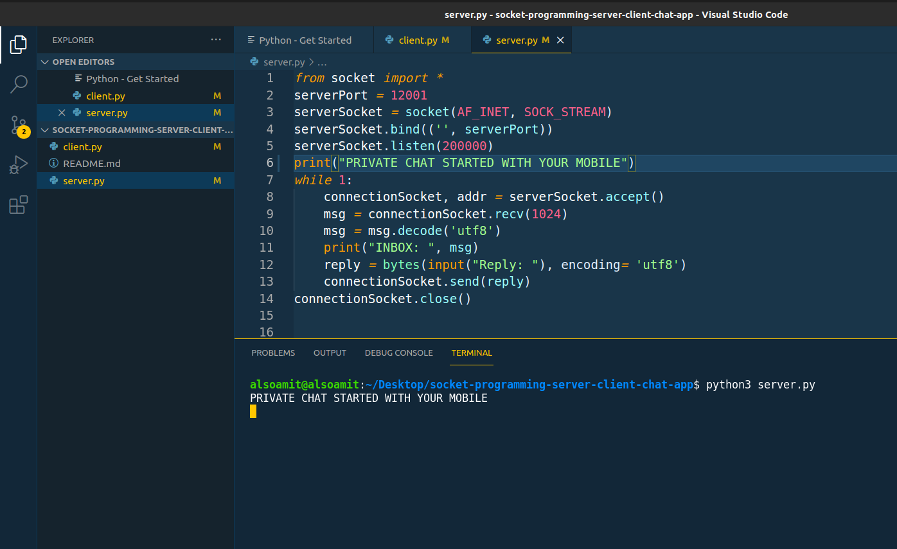

This is a simple chat app in python where server and client can simultaneously talk with each other over a direct network.
 

<h2>How to use it?</h2>
You need two devices: A laptop and a mobile phone with an internet connection. Provide the wifi access to your laptop from your mobile. You can do this with two mobile phones also.
 
You should have basic knowledge of Python.
 
 
<h2>Now follow these steps</h2>
1. Clone this repository and run the server.py file from the terminal. It will say PRIVATE CHAT STARTED WITH YOUR MOBILE. 
 
2. On the mobile, you need to use pydroid which is a python interpreter and code editor for python on android.
 
3. Paste the code from client.py in pydroid, change the Ip Address to be your mobile's IP address and run it. 
  
4. Now chat back and fourth in the terminal.
 
 
<h2>PREVIEW</h2>

